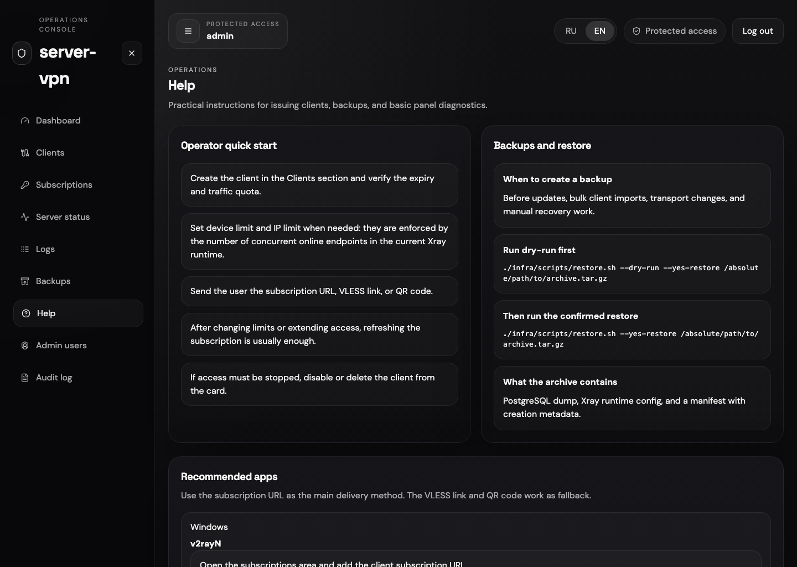

# xray-vpn-control-plane

[English](#english) | [Русский](#русский)

Self-hosted Xray VPN control plane for a single VPS: `VLESS + REALITY`, admin panel, subscriptions, backups, audit logs, and a deployment flow that stays simple enough for real operators.

Self-hosted панель управления Xray VPN для одного VPS: `VLESS + REALITY`, админ-панель, подписки, резервные копии, аудит и развёртывание без лишней инфраструктурной сложности.

Authenticated panel preview: Help page with the full navigation shell and operator guidance.

Пример авторизованной панели: страница Help с полным shell-интерфейсом и операторскими подсказками.

## English

### What It Is

`xray-vpn-control-plane` is a single-repository control plane for operators who want more than raw Xray config files, but less than a full orchestration platform. It combines:

- `Xray-core` as the data plane
- `NestJS + Prisma + PostgreSQL` as the control plane
- `React + Vite` as the admin UI
- `Docker Compose` as the default deployment model

### Why It Stands Out

- Built for a real single-VPS deployment, not for demo-only local setups
- Ships a usable admin panel instead of only config templates
- Includes subscriptions, QR export, backups, logs, audit trail, roles, and `TOTP 2FA`
- Keeps the stack understandable: no Kubernetes, no external control SaaS, no unnecessary moving parts

### At a Glance

- Default transport: `VLESS + REALITY + XTLS Vision`
- Admin roles: `SUPER_ADMIN` and `OPERATOR`
- Web panel: bilingual `EN/RU`
- Runtime services: `api`, `postgres`, `xray`, `caddy`
- Current deployment model: single VPS, panel on `8443`, Xray on `443`

### Quick Start

1. Copy [`.env.example`](./.env.example) to `.env`.
2. Replace every placeholder secret.
3. Generate REALITY keys with `xray x25519`.
4. Review [DEPLOY.md](./DEPLOY.md).
5. Run `docker compose up -d --build`.
6. Open the panel on `https://YOUR_HOST:8443`.

### What You Can Do With It

- Create clients, extend expiry, reset traffic, disable access, and export/import records
- Generate `VLESS` links, subscription URLs, and QR codes
- Sync clients to live `Xray` without manual JSON edits
- Track runtime health, backups, logs, and audit events from the panel
- Run a small operator workflow with subordinate `OPERATOR` accounts

### Recommended Clients

- Windows: `v2rayN`
- Android: `v2rayNG`
- iPhone / iPad / macOS: `Streisand`
- macOS alternative: `FoXray`

### Documentation

| Topic | English | Russian |
| --- | --- | --- |
| Architecture | [ARCHITECTURE.md](./ARCHITECTURE.md) | [docs/ru/ARCHITECTURE.md](./docs/ru/ARCHITECTURE.md) |
| Deployment | [DEPLOY.md](./DEPLOY.md) | [docs/ru/DEPLOY.md](./docs/ru/DEPLOY.md) |
| Security | [SECURITY.md](./SECURITY.md) | [docs/ru/SECURITY.md](./docs/ru/SECURITY.md) |
| Roadmap | [ROADMAP.md](./ROADMAP.md) | [docs/ru/ROADMAP.md](./docs/ru/ROADMAP.md) |
| Admin Guide | [docs/ADMIN_GUIDE.md](./docs/ADMIN_GUIDE.md) | [docs/ru/ADMIN_GUIDE.md](./docs/ru/ADMIN_GUIDE.md) |
| User Guide | [docs/USER_GUIDE.md](./docs/USER_GUIDE.md) | [docs/ru/USER_GUIDE.md](./docs/ru/USER_GUIDE.md) |
| Troubleshooting | [docs/TROUBLESHOOTING.md](./docs/TROUBLESHOOTING.md) | [docs/ru/TROUBLESHOOTING.md](./docs/ru/TROUBLESHOOTING.md) |
| Contributing | [CONTRIBUTING.md](./CONTRIBUTING.md) | [CONTRIBUTING.md#русский](./CONTRIBUTING.md#русский) |

### Roadmap Snapshot

- Safer UI restore flow
- Richer analytics and historical charts
- Better logs UX
- Easier public-domain onboarding for the panel

### Community

- Bug reports: [Issues](https://github.com/Twoia-Kotletochka/xray-vpn-control-plane/issues)
- Ideas and roadmap discussion: [Discussions](https://github.com/Twoia-Kotletochka/xray-vpn-control-plane/discussions)
- Contribution guide: [CONTRIBUTING.md](./CONTRIBUTING.md)
- Security policy: [SECURITY.md](./SECURITY.md)

## Русский

### Что Это Такое

`xray-vpn-control-plane` это control plane для операторов, которым уже мало просто редактировать raw-конфиги Xray, но не нужна тяжёлая orchestration-платформа. В репозитории уже собраны:

- `Xray-core` как data plane
- `NestJS + Prisma + PostgreSQL` как control plane
- `React + Vite` как админ-панель
- `Docker Compose` как базовая модель развёртывания

### Почему Проект Полезен

- Заточен под реальный single-VPS deployment, а не только под локальный demo
- Даёт рабочую панель управления, а не просто шаблоны конфигов
- Уже включает подписки, QR, бэкапы, логи, аудит, роли и `TOTP 2FA`
- Стек остаётся понятным: без Kubernetes, без внешнего control SaaS, без лишней сложности

### Коротко По Возможностям

- Профиль по умолчанию: `VLESS + REALITY + XTLS Vision`
- Роли: `SUPER_ADMIN` и `OPERATOR`
- Панель: двуязычная `EN/RU`
- Сервисы: `api`, `postgres`, `xray`, `caddy`
- Текущая схема: один VPS, панель на `8443`, Xray на `443`

### Быстрый Старт

1. Скопируй [`.env.example`](./.env.example) в `.env`.
2. Замени все плейсхолдеры на реальные секреты.
3. Сгенерируй REALITY ключи командой `xray x25519`.
4. Проверь [DEPLOY.md](./DEPLOY.md).
5. Запусти `docker compose up -d --build`.
6. Открой панель по адресу `https://ВАШ_ХОСТ:8443`.

### Что Уже Можно Делать

- Создавать клиентов, продлевать срок, сбрасывать трафик, отключать доступ, импортировать и экспортировать записи
- Генерировать `VLESS`-ссылки, subscription URLs и QR-коды
- Синхронизировать клиентов в live `Xray` без ручного редактирования JSON
- Смотреть health, backups, logs и audit events прямо из панели
- Работать с подчинёнными аккаунтами уровня `OPERATOR`

### Подходящие Клиенты

- Windows: `v2rayN`
- Android: `v2rayNG`
- iPhone / iPad / macOS: `Streisand`
- macOS alternative: `FoXray`

### Сообщество И Вклад

- Баги и запросы: [Issues](https://github.com/Twoia-Kotletochka/xray-vpn-control-plane/issues)
- Идеи и обсуждение roadmap: [Discussions](https://github.com/Twoia-Kotletochka/xray-vpn-control-plane/discussions)
- Как вносить изменения: [CONTRIBUTING.md](./CONTRIBUTING.md#русский)
- Безопасность: [SECURITY.md](./SECURITY.md)
